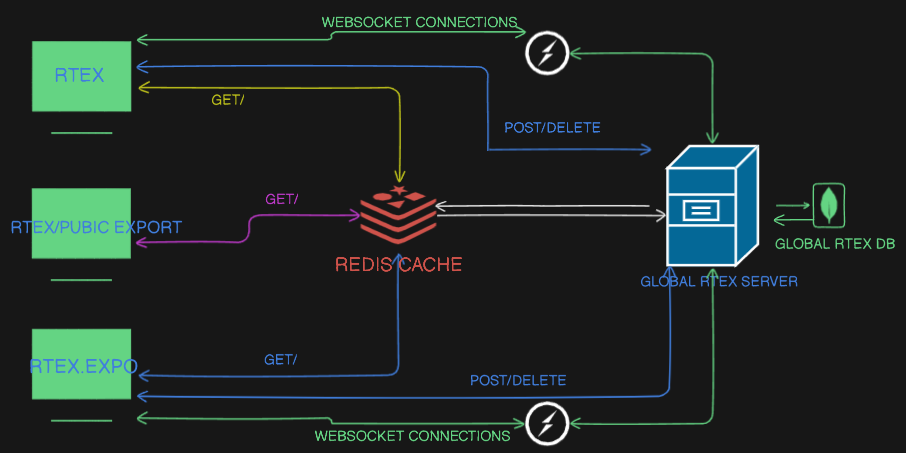
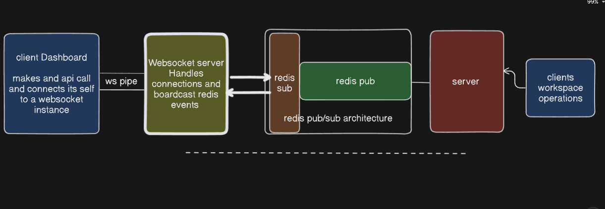
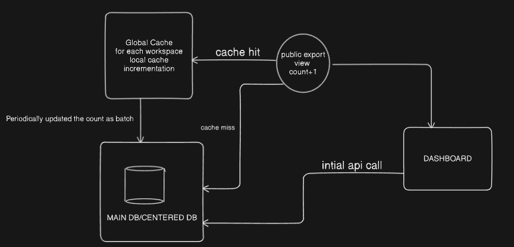
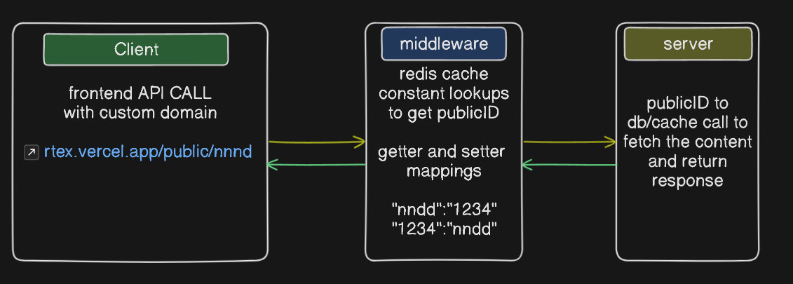

# RTEX - Real-Time Collaborative Text Editor

## Overview
RTEX is a modern collaborative online text editor that enables real-time document collaboration. It features seamless Google Drive integration, custom workspace management, and secure document sharing capabilities.

## RTEX EXPO
RTEX EXPO is a campanion of RTEX, build for providing overall dashboard for all the exports published via RTEX exports.

## Key Features
- **Google Drive Integration**: Seamlessly save and sync documents with Google Drive
- **Real-time Collaboration**: Work simultaneously with multiple users on the same document
- **Custom Workspace Export**: Export your workspaces in various formats with customizable options
- **Custom DNS Service**: Set up your own domain for private instances
- **Secure Document Sharing**: Protect your exports with passcodes
- **User-Friendly Interface**: Clean, intuitive interface for efficient document editing
- **Cross-Platform Compatibility**: Access from any modern web browser

## Architectures
- Overall current architecture/flow

- Overall current RTEXEXPO architecture/flow

- Scalable View Updation architecture in RTEXEXPO

- Custom DNS RTEX architecture


### System Components
- Frontend (React.js)
- Backend (Node.js)
- WebSocket Server
- Database (MONGO-DB)
- Google Drive API Integration
- Authentication Service
- Redis Cache

## Installation

### Prerequisites
- Node.js (v14 or higher)
- npm or yarn
- MongoDB

### Setup
1. Clone the repository:
```bash
git clone https://github.com/AmitVaishnav22/RTEX.git
```

2. Navigate to project directory:
```bash
cd RTEX
```

3. Install dependencies:
```bash
npm install
```

4. Configure environment variables:
```bash
cp .env.example .env
# Edit .env with your configuration
```

## Usage

### Development Mode
```bash
npm run dev
```

### Production Mode
```bash
npm run build
npm start
```

## Features Demo
Watch our demo video to see RTEX in action:

<video width="640" height="360" controls>
  <source src="./docs/demo/demo.mp4" type="video/mp4">
  Your browser does not support the video tag.
</video>

<!-- ## API Documentation
Access our API documentation at `/api/docs` when running the server. -->

## Security
- End-to-end encryption for document content
- Secure authentication using JWT
- Password-protected document sharing
- Rate limiting and DDoS protection

## Contributing
We welcome contributions! Please follow these steps:

1. Fork the repository
2. Create your feature branch:
```bash
git checkout -b feature/amazing-feature
```
3. Commit your changes:
```bash
git commit -m 'Add amazing feature'
```
4. Push to the branch:
```bash
git push origin feature/amazing-feature
```
5. Open a Pull Request

## Project Structure
```
RTEX/
├── frontend/          # Frontend React application
├── backend/          # Backend Node.js server
├── rtexExpo/            # RTEXEXPO Frontend dashboard
├── tests/           # Test suites  # (not present)
└── docker/          # Docker configuration (not present)
```

## License
This project is licensed under the MIT License - see the [LICENSE](LICENSE) file for details.

## Contact
- **Developer**: Amit Vaishnav
- **GitHub**: [AmitVaishnav22](https://github.com/AmitVaishnav22)
- **Email**: vaishnanamit@gmial.com

## Acknowledgments
- Thanks to all contributors
- Built with React, Node.js, and Socket.io
- Inspired by modern collaborative editing tools